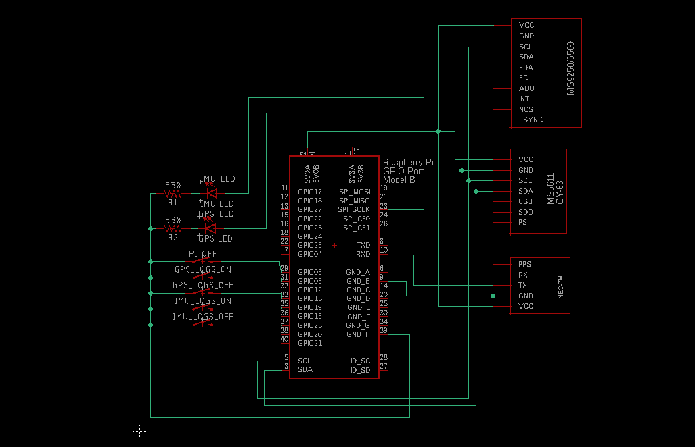
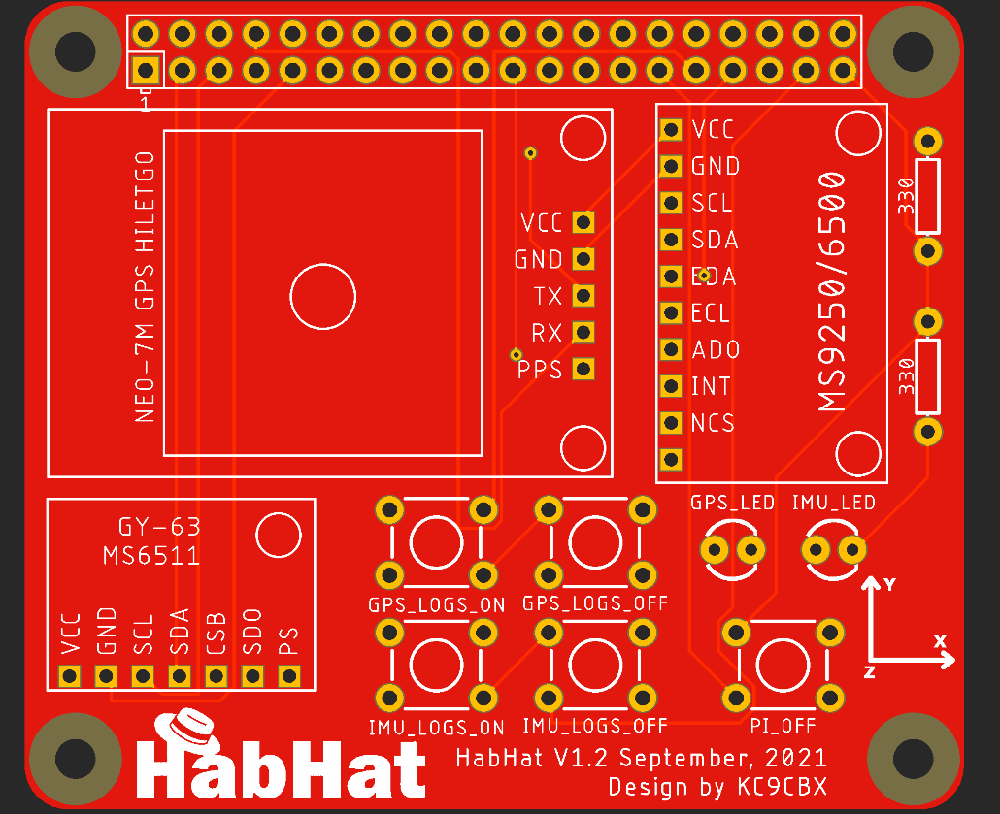

# HabHat
## Description
HabHat is a Raspberry Pi add-on module, in a "hat" form factor, designed to plug right in to the GPIO pins on a Raspberry Pi. While the board size and form factor match the B+ Pis, it will physically work with any Pi that has 40-pin header.

## What does it do?
HabHat is a Raspberry Pi add-on board meant to simplify data acquisition and logging for High Altitude Balloon (HAB) flights. It will capture GPS location, temperature, pressure (altitude), along with positional data from an accelerometer, gyroscope, and a magnetometer. Combining this data captures physical state of the HAB payload throughout the flight and it can be used as an experiment on its own (lot of wild stuff going on in the upper atmosphere), or to use this data to complement any other experiments performed during the flight. For example, if your mission is to capture pictures or video during the flight, it is very useful to know where the payload was (location and altitude), where was it pointed, was there any motion (swinging) when images were captured, in what direction, how fast, etc. 

## Hardware
As the design is meant to be used for HAB applications, that drove some of the design and part selection decisions. The circuit itself is very simple - we use I2C bus for sensors and serial port for GPS. That means that all we have is clock and data lines for I2C, RX and TX for serial, and of course power and ground to all the devices. We also have a few buttons and couple of LEDs connected to GPIO pins - these are nice to have, but not necessary for the core functionality. 

The final HabHat implementation uses a PCB, but since the circuit is very simple, it can be very easily made on a breadboard or a solder perf board. PCB gerber files are included.

## Sensors 
Sensors that we used are MS5611 and MS9250. Both are very inexpensive and broadly available from many other distributors. The actual sensors are SMD devices, so to make the whole thing more accessible, simplify the design, assembly, and use, we decided to use premade sensor modules instead of mounting SMD components ourselves. These premade modules already have all supporting components that sensors need, along with voltage regulators, providing greater flexibility.

 - **MS6511** is a high precision pressure sensor with an operating range of 10 to 1200 mbar, under temperatures of -40 to +85 °C. Pressure is often used to determine altitude during HAB flights as GPS is not always very accurate in this respect. This sensor is ideal because pressure gets very low at very high altitudes (10.9 mbar @ 100,000ft (~30,000m)). So, the measuring range and measuring resolution (0.012 mbar) of this sensor, makes it a perfect for HAB applications. When used as an altimeter, it can provide accuracy of around 10cm.
 
 - **MPU9250** module is a 9-axis motion tracking device. It is a multi-chip module that contains two separate devices - MPU-6500 and AK8963. MPU-6500 is a 3-axis gyroscope, 3-axis accelerometer, and a temperature sensor. AK8963 is a 3-axis magnetometer.
 
 Combining data from these two sensors provides all the data necessary to understand relative motion and position of the HAB payload.
 
 ## GPS Module
 Much like with the sensors, we used a GPS module board, with uBlox NEO 7M GPS receiver and supporting components already mounted on. This particular module was chosen because it in addition to the GPS receiver it has on-board EEPROM, backup battery, usb and serial interface, along with an external antenna connector. 
 
 Like most GPS receivers, by default, 7M will not operate at high altitudes - with default settings, it will just stop at around 60,000 ft (18 km). uBlox provides u-center - GPS receiver management suite - that allows the default configuration to be changed, to enable operation at high altitudes. This necessary configuration change is why EEPROM is important - once changed, the configuration is then be saved to the on-board EEPROM, making this a one-time change. 
 
 Other receivers, without an EEPROM, can also be used, but additional code would then be needed to set the receiver to high altitude mode every time it is powered on.
 

## Buttons and LEDs
As mentioned before, these are not required for the core functionality, but they are rather meant to provide a rudimentary user interface that allows the end user to see the system status at a glance, and to provide for some simple troubleshooting functionality. 

LEDs light up when data is being logged. System has two data logs, one for positional data and one for GPS - status of each log is indicted by one of the LEDs. Behind the scenes, a script monitors that log is growing as the time goes on, meaning that data is being logged into it. Of course, this approach says nothing about the validity or quality of captured date, only that data is being captured. 

If a log stops growing, that means that we have a problem of some sort, and the LED for that log will turn off. Now that we know that there is a problem, we can use corresponding "OFF" button (GPS_LOGS_OFF for GPS log, for example) to first terminate the script that is doing the logging and then the "ON" button (GPS_LOGS_ON for GPS log) to restart the logging. If that corrects the problem, after about 15 seconds, the LED indicating health of that log will come back on.

**Please note that LEDs do not react instantly to the changes in the log status.** For example, if you press the button to terminate logging for the GPS, it may take 10-15 seconds for the LED to turn off, indicating that logging has stopped. This is by design - watchdog will not trigger unless there are multiple consecutive failures and it takes time for that to happen. This behavior can be modified by editing the code for the appropriate watchdog in the "Watchdogs" folder.

In addition to the buttons to start and stop the logging scripts, we also have a button that is used to properly shut down the Raspberry Pi. When pressed, this button will simply issue the "poweroff" command to the Pi.

## Software
Software is written in Python 3, with some supporting functionality done with shell scripts. Interfacing with sensors was accomplished using pre-existing libraries. For MS5611, we used a library available [here](https://github.com/jfosnight/jonahsystems/tree/master/python) and for MPU9250, the one available [here](https://github.com/Intelligent-Vehicle-Perception/MPU-9250-Sensors-Data-Collect). GPS data is accessed using the [GPSd service](https://gpsd.io/). 

To make setup and installation simple, everything that is needed to configure a Rapberry Pi to work with HabHat is found in the "Tools" folder. This folder has all the code needed to run the logging as well as necessary configuration and setup files. 

Here is a quick rundown of the Tools folder.

 - **Autostart** - contains pre-configured rc.local file, that is copied to /etc/rc.local during setup
 - **ConfigLEDs** - script used to setup GPIO pins needed to control the LEDs
 - **GPSdConfig** - GPSd config file that is copied to /etc/default/gpsd during setup
 - **GPSLogOff** - scripts for GPSLogOff button
 - **GPSLogOn** - scripts for GPSLogOn button
 - **GPSTime** - scripts used to set system time from GPS
 - **IMULogOff** - scripts for IMULogOff button
 - **IMULogOn** - scripts for IMULogOn button
 - **Logger** - IMU and GPS logging scripts
 - **PowerOff** - scripts for PowerOff button
 - **Watchdogs** - scripts that monitor log activity and control the LEDs
 
 To see now to get it all set up and installed, take a look at the installation section.
 
 
